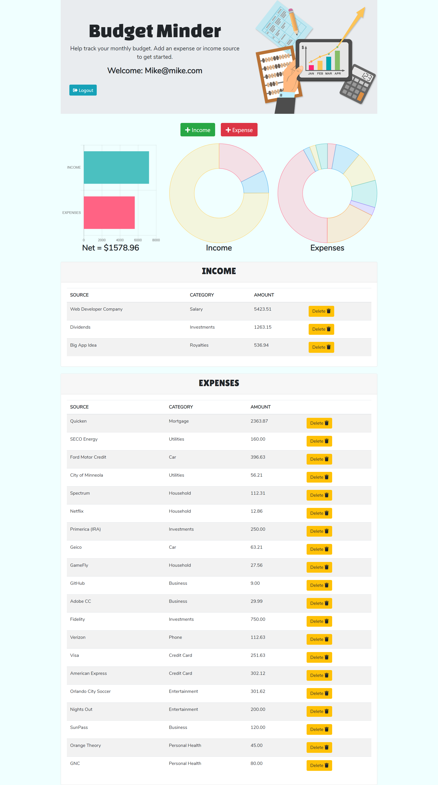

# Budget-Minder

### Budget minder is a monthly budgeting app created with Chart.js for a visual appeal. It is also built with lots of other frameworks and has full authentication for a individualized experience. This has been deployed using Heroku and a Jaws Database.
---
## Screenshots

## Technologies Used
* JavaScript
* Node.js
* jQuery
* CSS
* Handlebars
* HTML
* mySQL DB
* Express
* Sequelize
* NPM Packages
    * bcrypt-nodejs
    * body-parser
    * dotenv
    * eslint
    * express
    * express-handlebars
    * express-session
    * mysql
    * mysql2
    * passport
    * passport-local
    * sequelize
* Heroku
* Google Fonts
* Font Awesome
* Visual Studio Code
* DBeaver
* Kanban

## Try Budget Minder
https://whispering-brushlands-86112.herokuapp.com/